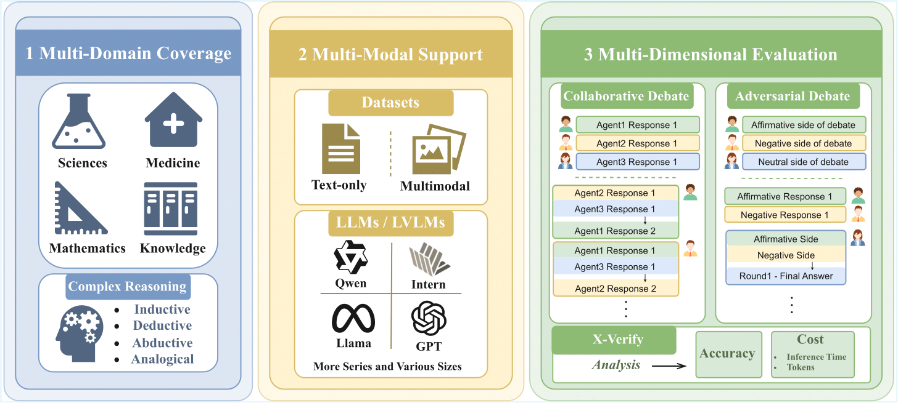

# M3MAD-Bench: Are Multi-Agent Debates Really Effective Across Domains and Modalities?
[📖 Paper](111)



M3MAD-Bench is a unified and extensible benchmark for evaluating Multi-Agent Debate (MAD) methods across **M**ulti-domain tasks, **M**ulti-modal inputs, and **M**ulti-dimensional metrics. We provide a reproducible codebase, standardized protocols, and comprehensive analyses so researchers can study MAD at scale with consistent settings.

- Covering five core task domains: **Knowledge**, **Mathematics**, **Medicine**, **Natural Sciences**, and **Complex Reasoning**.
- Including 13 datasets (7 text-only, 6 multimodal) so researchers can perform controlled vision-language vs. pure-text comparisons.
- Supporting lots of base models with diverse architectures, scales, and modality capabilities.
- Measuring accuracy alongside cost-oriented metrics (token consumption, inference latency) to expose performance–cost trade-offs.

---

## Repository Layout

```
├── datasets/                 # Dataset builders and processed JSON files
├── methods/                  # MAD, DMAD, CoT, IO, LLM-Debate, Self-Consistency implementations
│   ├── div_mad/              # Div-MAD method (renamed from MAD)
│   ├── dmad/                 # Diverse MAD (DMAD)
│   ├── cot/                  # CoT baseline
│   ├── io/                   # Direct IO baseline
│   ├── llm_debate/           # LLM Debate baseline
│   └── self_consistency/     # Self-consistency baseline
├── model_api_configs/        # API endpoints for local/remote models
├── local_api_server/         # Example configs for LLaMA-Factory deployments
├── results/                  # Default output directory for JSONL traces/stats
├── utils/                    # Shared utilities (plotting, evaluation helpers, etc.)
├── inference.py              # Entry point for evaluating MAD methods
├── env.yaml                  # Reproducible Conda environment
└── MAD.md                    # Extended whitepaper for the codebase
```

---

## 1. Environment Setup

We recommend Conda (or Mamba) for dependency management:

```bash
conda env create -f env.yaml
conda activate mad
```

The environment includes OpenAI-compatible clients, vision-language dependencies, and experiment tooling. You may safely remove the `prefix` field from `env.yaml` if it points to a user-specific path.

---

## 2. Dataset Preparation

Use the helper script to build any supported dataset:

```bash
python datasets/build_test_dataset.py --dataset_name <dataset_name>

# examples
python datasets/build_test_dataset.py --dataset_name MMLU
python datasets/build_test_dataset.py --dataset_name MathVision
```

The builder normalizes formatting and produces `datasets/data/<dataset>.json`. Add new datasets by contributing to the builder script and documenting the corresponding JSON schema.

---

## 3. Model & API Configuration

M3MAD-Bench interacts with models through a simple OpenAI-compatible interface.

1. **Configure API endpoints** in `model_api_configs/model_api_config.json`. Each entry specifies the model name, base URL, API key, and maximum concurrent workers.
2. **Deploy local models (optional)** using [LLaMA-Factory](https://github.com/hiyouga/LLaMA-Factory):
   ```bash
   git clone --depth 1 https://github.com/hiyouga/LLaMA-Factory.git
   cd LLaMA-Factory
   pip install -e ".[torch,metrics]"
   API_PORT=8000 CUDA_VISIBLE_DEVICES=0 \
     llamafactory-cli api ../MAD/local_api_server/sample_api.yaml
   ```
3. Register the endpoint in `model_api_config.json` (example: `"qwen-vl-local"`). Any OpenAI-compatible host, including cloud APIs, can be used.

---

## 4. Running Experiments

### 4.1 Debug Mode

```bash
python inference.py --method_name <method> --debug
```

This prints intermediate debate steps and token usage for quick sanity checks.

### 4.2 Full Inference

```bash
python inference.py \
  --model_name qwen-vl-local \
  --method_name div_mad \
  --test_dataset_name MMLU_subset \
  [--method_config_name config_main] \
  [--sequential] \
  [--output_path ./results/...jsonl]
```

Key arguments:

- `--model_name`: must match a key in `model_api_config.json`.
- `--method_name`: one of `div_mad`, `dmad`, `llm_debate`, `cot`, `io`, or `self_consistency`.
- `--method_config_name`: optional YAML under `methods/<method>/configs/`.
- `--sequential`: force single-threaded evaluation; otherwise, we parallelize using the configured worker pool.
- `--require_val`: load `<dataset>_val.json` and call `optimizing()` before inference if the method defines it.

Outputs include per-sample JSONL traces and a `*_stats.json` summary (token counts, runtime, etc.).

---

## 5. Adding New MAD Variants

1. Create a new subdirectory under `methods/` following the structure used by `div_mad` and `dmad`.
2. Inherit from `methods.mad_base.MAD` to obtain configuration loading, model orchestration, and logging utilities.
3. Register the method name in `methods/__init__.py`.
4. Provide example configs in `methods/<method>/configs/` and update this README (or your paper) with any caveats.

---

## 6. Benchmark Dimensions & Metrics

- **Multi-Domain Coverage:** Knowledge, Mathematics, Medicine, Natural Sciences, and Complex Reasoning.
- **Multi-Modal Support:** Balanced suite of text-only and vision–language datasets enables controlled modality comparisons.
- **Multi-Dimensional Evaluation:** Accuracy, token consumption, and inference latency. Raw logs make it easy to derive further metrics (e.g., debate rounds, judge agreement).
- **Model Diversity:** Five series of base models covering open-source and API endpoints; plug in any OpenAI-compatible backend.


Happy debating! 🗣️🤝📊
